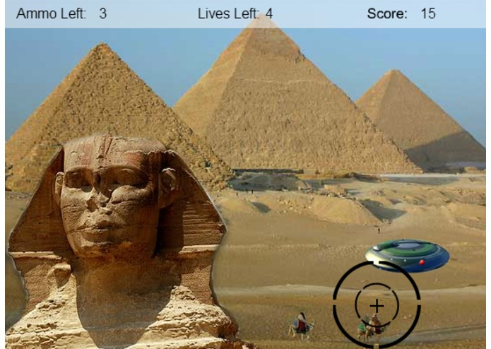
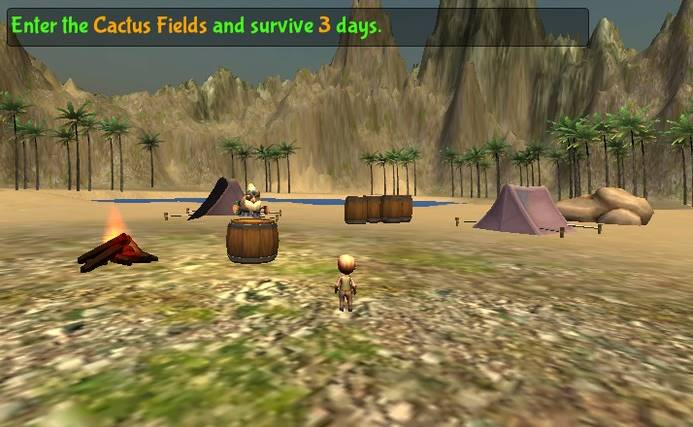

## Welcome 

This is a summary of all the games made by me and my kids, mostly for fun in our spare time, and at game jams or hackathons.  

---
### Alien Invasion - 2010 First Game Project With 14 year old Son Nathan

See the Wonders of the World while shooting missles at the Alien Invaders.

#### Developer Notes
- Made with flash
- Made with my 10 year old son Nathan
- This was his first experience with game programming
- I think we had just watched the Independence Day movie

#### Download Link
- Not available

---
### Metro Squares - 2012 Windows Store App

This was my first game that I published in the windows store.  The funny thing is, these first few games, aren't really using any sort of game framework at all but just the Metro Xaml UI that came out with Windows 8.

#### Developer Notes

- My kids like this game, and I wanted to make something they would enjoy.
- I wrote it to experiment with how the new windows metro UI works
- And to try the publishing process in the new Windows store for Windows 8.  
- I was also on my way to Microsoft Build and was entering a Hackathon that I wanted to prepare for it.

#### Statistics

- This has been downloaded over **8000** times in the windows store.

#### Download Link 

- [https://www.microsoft.com/en-us/p/metro-squares](https://www.microsoft.com/en-us/p/metro-squares){:target="_blank"}

---
### Jungle Chess - 2012 Microsoft Hackathon Entry

#### Developer Notes

- At the Microsoft Build Conference in 2012, we attended a Hackathon during where we had **24 hours** to 
build something using the new Metro UI that Microsoft had recently released for Windows 8.  
- If I recall correctly, we won **$500** for taking 2nd place in our category.

---
### Psychic Cards - 2012 Windows Store App

#### Developer Notes

- After coming back from the Microsoft Build Conference, I was still messing around with the new UI features, and wrote this.

#### Statistics

- This game has been downloaded **3000+** times from the Microsoft Store

#### Download Link 

- [https://www.microsoft.com/en-us/p/psychic-cards](https://www.microsoft.com/en-us/p/psychic-cards){:target="_blank"}

---
### SudokuWin8 - 2013 Windows Store App

#### Developer Notes

- I like Sudoku, so decided to write my own
- Turns out Sudoku puzzles can generated by shuffling other puzzles
- When I translated this into 20+ languages, I started getting a lot of downloads
- I only spent like a day writing this

#### Statistics

This has been downloaded over **285,000+** times

#### Download Link 

- [https://www.microsoft.com/en-us/p/sudokuwin8](https://www.microsoft.com/en-us/p/sudokuwin8){:target="_blank"}

---
### Sudoku Slider - 2013 Windows Store App

Sudoku meets slider puzzle!  Playing of the success of SudokuWin8, this is a challenging new twist on Sudoku that you are sure to enjoy. Sudoku Slider combines traditional Sudoku with a slider puzzle. The space with the Chomper is an empty space. Slide the surrounding number tiles into the empty space. When a number is in the correct spot it will turn yellow. When all the numbers are yellow you win!

#### Developer Notes
- Was low hanging fruit since I already had the sudoku code base
- Used Azure for leaderboard

#### Statistics
- This has been downloaded over **4000** times.

#### Download Link
- [https://www.microsoft.com/en-us/p/sudoku-slider](https://www.microsoft.com/en-us/p/sudoku-slider){:target="_blank"}

---
### Cube Genuis - 2013 Windows Store App

Amaze your friends and family by learning to solve the cube. You can compete against other players worldwide to see who can solve the cube the fastest and in the fewest moves. This app is the only FREE cube app in the Windows Store that lets you actually solve the cube. Become a Cube Genius today!
#### Developer Notes
- I developed this with a co-worker
- This was our first attempt at 3D game
- We released on both Windows 8 and Windows Phone
#### Statistics
- This has been downloaded over **100,000** times

#### Download Link
- [https://www.microsoft.com/en-us/p/cube-genius](https://www.microsoft.com/en-us/p/cube-genius){:target="_blank"}

---
### Mana Mania - 2014 LDS Tech Game Contest Entry

Manna Mania is a fun adventure game loosely based on events in the Old Testament. It is good family fun for kids of any age. Help Moses save the Israelites by collecting Manna, finding his serpent staff and hiding Idols! Manna Mania is many hours of good clean fun. Best of all it is Free!

#### Developer Notes
- Our first game using Unity
- Me and two co-workers developed this game in 2 weeks for the 2014 LDS Tech contest
- We won honorable mention

#### Download Link
- [https://www.microsoft.com/en-us/p/manna-mania](https://www.microsoft.com/en-us/p/manna-mania){:target="_blank"}

---
### No Escape - Global Game Jam 2015 

You wake up locked in a prison cell. You are plagued with repeated out of body like visions that allow you to leave your cell and explore the prison. Can you escape the prison, or is it only in your mind? The main character in this game is mentally ill. It explores the mind of a mentally ill person and how they struggle to function in society.

#### Developer Notes
- This was the first game jam that my son Nathan (15 years old at the time) participated in
- He did the modeling for the entire environment
- I did the programming, and lighting
- Most the other art work was free from the asset store

#### Github Link
- [https://github.com/worthingtonjg/NoEscape](https://github.com/worthingtonjg/NoEscape){:target="_blank"}

#### Global Game Jam Link
- [https://globalgamejam.org/2015/games/no-escape](https://globalgamejam.org/2015/games/no-escape){:target="_blank"}

#### Play the game
- [http://worthingtonjg.github.io/NoEscape/](http://worthingtonjg.github.io/NoEscape/){:target="_blank"}

---
### Utah Indie Game Jam 2015 - Theme: What do we do now?
Survive Oblivion
https://cypherjw.itch.io/oblivion-the-secret-of-survival
#### Developer Notes
#### Statistics
#### Download Link

---
### LDS Tech Game Contest 2015
Book of Mormon Adventure
https://devpost.com/software/book-of-mormon-adventures
#### Developer Notes
#### Statistics
#### Download Link

---
### Microsoft Build 2016 Hackathon
Virtual Band
https://devpost.com/software/virtual-band-0xcgwp
#### Developer Notes
#### Statistics
#### Download Link

---
### Global Game Jam 2016 - Theme: Ritual
Relic Hunter
https://globalgamejam.org/2016/games/relic-hunter
#### Developer Notes
#### Statistics
#### Download Link

### AttackBots 
https://github.com/worthingtonjg/AttackBots
#### Developer Notes
#### Statistics
#### Download Link

---
### Utah Indie Game Jam 2016 - Hidden
Hololens - Zombie Ship
https://cypherjw.itch.io/hololens-the-hidden-facility
Won Audience Choice Award (1st of 15)
#### Developer Notes
#### Statistics
#### Download Link

### Smooch That Fish
https://itch.io/jam/utah-indie-game-jam-2016/rate/90265
Won Award for Most Educational
#### Developer Notes
#### Statistics
#### Download Link

---
### Global Game Jam 2017 - Waves
Laugh Kingdom
https://globalgamejam.org/2017/games/laugh-kingdom
#### Developer Notes
#### Statistics
#### Download Link

---
### Utah Indie Game Jam 2017 - Pacifist
Crazy Pacifist Quote Generator
https://cypherjw.itch.io/talking-pacifists
Won Left Field Award
#### Developer Notes
#### Statistics
#### Download Link

Pacifist of War 
https://itch.io/jam/utah-indie-game-jam-2017/rate/186220
#### Developer Notes
#### Statistics
#### Download Link

Penguin Pacifist
https://itch.io/jam/utah-indie-game-jam-2017/rate/186217
#### Developer Notes
#### Statistics
#### Download Link

---
### Global Game Jam 2018 - Transmission
Tran - A Tron Spoof
https://globalgamejam.org/2018/games/tran-tron-spoof
#### Developer Notes
#### Statistics
#### Download Link

---
### The Space Guardian - 2019 Global Game Jam  What home means to you

In this VR game for the 48 hour game jam that had the theme: "What home means to you", you are the Space Guardian, who is defending earth from aliens, while the humans escape to find a new home among the stars. 

#### Developer Notes
- Virtual Reality targeting Microsoft Mixed Reality Headsets

#### Contributors
- Me, Jim Byer, Nathan and Ryan

#### Global Game Jam Link
- [https://globalgamejam.org/2019/games/space-guardian](https://globalgamejam.org/2019/games/space-guardian)

#### Github Link
- [https://github.com/worthingtonjg/GGJ2019](https://github.com/worthingtonjg/GGJ2019)

---
### Love Potion - 2019 Utah Indie Game Jam

A love potion goes terribly wrong turning you into a monster - can you find the ingredients to turn yourself handsome enough and marry the princess?

This is an action adventure game based on the 48 hour game jam theme:

**"You Are What You Eat".**

Play as love struck Jim whose only goal is to woo the princess Cindy, but takes a wrong turn on the way to love and ends up battling a host of monsters to make himself handsome enough to marry his true love.

#### Developer Notes
- We where able to create a game that has 5 levels, 5 different enemies, and 5 different players.
- Ryan learned how to use Gaia to generate the terrian
- Ryan also learned how setup animation controllers
- Ryan did all the voice overs and sounds for the enemies 
- Nathan did modeling and helped with the level design
- I did all the cutscenes, and programming

#### Result
- Won Best Narrative 
- AND Best Use of Tech!

#### Download Link
- [https://cypherjw.itch.io/love-potion](https://cypherjw.itch.io/love-potion){:target="_blank"}

---
### Drift Racer - 2020 Global Game Jam 

In this 48 hour game jam, the theme was "Repair".  

In Drift Racer choose from 8+ ships and race against your friends in this face paced and fun race game. Collect parts to repair and upgrade your ship! 

#### Challenges
- Ryan did all the pixel art!
- The glow effect shaders came from the asset store
- The levels and powerups were designed by Nathan
- I did the programming 

#### Contributors
- Me, Nathan and Ryan

#### Global Game Jam Link
- [https://globalgamejam.org/2020/games/alien-wars-6](https://globalgamejam.org/2020/games/alien-wars-6){:target="_blank"}

#### Github Repo
- [https://github.com/worthingtonjg/DriftRacer](https://github.com/worthingtonjg/DriftRacer){:target="_blank"}

#### Play the game
- [https://worthingtonjg.github.io/DriftRacer/](https://worthingtonjg.github.io/DriftRacer/){:target="_blank"}

---
### Dr Strange - 2021 Utah Indie Game Jam Entry 

The theme for this 48 hour game jam was "Reincarnation".  Meet Dr. Strange!  He is a crazy scientist obsessed with discovering the secret to **reincarnation** at all costs.

#### Challenges
- What made this game jam more challenging was that both Nathan and Ryan had to work most of Saturday, so had less time to help.
- Also Jim Byer decided not to help us much, but did add his own mini-game, which we included in the menu.
- We had a new team member this year (Nicholas Terry) and had to learn to work as a team with someone we hadn't worked with before.

#### Contributors
- Nathan: Level Design and Animation Rigging
- Ryan: Level Design, Animation Rigging, Sounds and Music
- Me: I worked on the Cut Scenes, Story, Navmesh AI and Programming, Ship Flying mini-game, UI, Particle Effects
- Nick: Character Controller, Interactables, Modeling
- Jim: Shooter mini-game
- Most the artwork was free from the asset store

#### Result

- We won the award for Best Narrative.

#### Github Repo
- [https://github.com/worthingtonjg/UtahIndieGameJam2021](https://github.com/worthingtonjg/UtahIndieGameJam2021)

#### Play the game

- [https://cypherjw.itch.io/dr-strange](https://cypherjw.itch.io/dr-strange){:target="_blank"}
