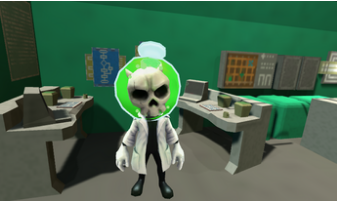
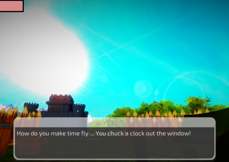

## Welcome 

I have been making games for fun with friends and family at game jams and hackathons for nearly 10 years.  Almost all these games were made in 48 to 72 hours.  There are two game jams a year that I like to attend.  The Global Game Jam in the spring and the Utah Indie Game Jam in the fall.  

Below you will find the list of all the games I've made over the years in reverse chronological order.

---
### Shape Factory - 2022 Global Game Jam

Shape Factory is an exciting 2 player factory matching game. Grab a friend and have fun racing to match all your shapes first! 

#### Rules

- Shapes placed on the main conveyor belt must match the color or shape of the currently displayed shape above. 
- If it doesn't match, you'll get a penalty, and more shapes will be added to your count.
- The shape and color you must match with will update and change to the shape or color of any valid shapes entered in. 
- If none of your shapes match, you can go to the button at the top of your play area and press it to generate a new, random shape (but this will increase your block count, so use it wisely). 
- The first player to match all of their shapes wins! 

#### Controls

- Blue Player/Left Player: WASD keys to move Space Bar to pick up/put down blocks, and push buttons 
- Red Player/Right Player: Arrow keys to move Zero (on Num Pad) to pick up/put down blocks, and push buttons

#### Developer Notes

- This was Andrea's first game jam, but she did a great job with the level design and art work.  The game turned out looking really nice!
- This is a 2 player / split screen game only.  It would be nice to create some AI so you could play against the computer.
- The theme of the game jam was Duality, our idea, was to be able to flip shapes over on the conveyor belt to turn them into sabotages, but we ran out of time and didn't get that implemented.

#### Contributors (left to right)

- Jim Byer (Programming)
- Jon Worthington (Programming)
- Andrea Blake (Art and Level Design)

#### Global Game Jam 2022 Page

- [https://globalgamejam.org/2022/games/shape-factory-0](https://globalgamejam.org/2022/games/shape-factory-0){:target="_blank"}

#### Github Repo

- [https://github.com/worthingtonjg/blockswap](https://github.com/worthingtonjg/blockswap){:target="_blank"}

#### Play the game

- [https://cypherjw.itch.io/shape-factory](https://cypherjw.itch.io/shape-factory){:target="_blank"}

---
### Dr Strange - 2021 Utah Indie Game Jam Entry 

The theme for this 48 hour game jam was "Reincarnation".  Meet Dr. Strange!  He is a crazy scientist obsessed with discovering the secret to **reincarnation** at all costs.

#### Developer Notes

- What made this game jam more challenging was that both Nathan and Ryan had to work most of Saturday, so had less time to help.
- Also Jim Byer decided not to help us much, but did add his own mini-game, which we included in the menu.
- We had a new team member this year (Nicholas Terry) and had to learn to work as a team with someone we hadn't worked with before.

#### Contributors

- Nathan: Level Design and Animation Rigging
- Ryan: Level Design, Animation Rigging, Sounds and Music
- Me: I worked on the Cut Scenes, Story, Navmesh AI and Programming, Ship Flying mini-game, UI, Particle Effects
- Nick: Character Controller, Interactables, Modeling
- Jim: Shooter mini-game
- Most the artwork was free from the asset store

#### Result

- We won the award for Best Narrative.

#### Github Repo
- [https://github.com/worthingtonjg/UtahIndieGameJam2021](https://github.com/worthingtonjg/UtahIndieGameJam2021){:target="_blank"}

#### Play the game

- [https://cypherjw.itch.io/dr-strange](https://cypherjw.itch.io/dr-strange){:target="_blank"}

---
### Drift Racer - 2020 Global Game Jam 

In this 48 hour game jam, the theme was "Repair".  

In Drift Racer choose from 8+ ships and race against your friends in this face paced and fun race game. Collect parts to repair and upgrade your ship! 

#### Developer Notes

- Ryan did all the pixel art!
- The glow effect shaders came from the asset store
- The levels and powerups were designed by Nathan
- I did the programming 

#### Contributors

- Me, Nathan and Ryan

#### Global Game Jam Link

- [https://globalgamejam.org/2020/games/alien-wars-6](https://globalgamejam.org/2020/games/alien-wars-6){:target="_blank"}

#### Github Repo

- [https://github.com/worthingtonjg/DriftRacer](https://github.com/worthingtonjg/DriftRacer){:target="_blank"}

#### Play the game

- [https://worthingtonjg.github.io/DriftRacer/](https://worthingtonjg.github.io/DriftRacer/){:target="_blank"}

---
### Love Potion - 2019 Utah Indie Game Jam

A love potion goes terribly wrong turning you into a monster - can you find the ingredients to turn yourself handsome enough and marry the princess?

This is an action adventure game based on the 48 hour game jam theme:

**"You Are What You Eat".**

Play as love struck Jim whose only goal is to woo the princess Cindy, but takes a wrong turn on the way to love and ends up battling a host of monsters to make himself handsome enough to marry his true love.

#### Developer Notes

- We where able to create a game that has 5 levels, 5 different enemies, and 5 different players.
- Ryan learned how to use Gaia to generate the terrian
- Ryan also learned how setup animation controllers
- Ryan did all the voice overs and sounds for the enemies 
- Nathan did modeling and helped with the level design
- I did all the cutscenes, and programming

#### Result

- Won Best Narrative 
- AND Best Use of Tech!

#### Gameplay Video

- [https://www.youtube.com/watch?v=sUTJplUN3Lo&feature=emb_logo](https://www.youtube.com/watch?v=sUTJplUN3Lo&feature=emb_logo){:target="_blank"}

#### Download Link

- [https://cypherjw.itch.io/love-potion](https://cypherjw.itch.io/love-potion){:target="_blank"}

---
### The Space Guardian - 2019 Global Game Jam 

In this VR game for the 48 hour game jam that had the theme: "What home means to you", you are the Space Guardian, who is defending earth from aliens, while the humans escape to find a new home among the stars. 

#### Developer Notes
- Virtual Reality targeting Microsoft Mixed Reality Headsets

#### Contributors
- Me, Jim Byer, Nathan and Ryan

#### Global Game Jam Link
- [https://globalgamejam.org/2019/games/space-guardian](https://globalgamejam.org/2019/games/space-guardian){:target="_blank"}

#### Github Link
- [https://github.com/worthingtonjg/GGJ2019](https://github.com/worthingtonjg/GGJ2019){:target="_blank"}

---
### Global Game Jam 2018 - Tran (A Tron Spoof)

The theme of this 48 hour game jam was "Transmission".  Being computer nerds, we decided to make a movie inspired entry based on Tron.  We took movie clips directly from both the 1982 version of the movie and the 2010 version of the movie and integrated them into our game to introduce each of our levels.   

<https://en.wikipedia.org/wiki/Tron>

#### Controls: 

- Player 1: AWSD (QE)
- Playser2: JKIL (OU)

#### Developer Notes

- The effect of the movie clips makes the game seem more polished than it really is.  
- Also we used some really cool glow effects in all the levels that I feel really added a good look and feel to the game.
- The free assets we used were: MK Glow Free, Sprite Glow, Kino Bloom, Fungus, Cyber Soldier

#### Contributors

- *Programming* - Jon Worthington (me) and Jim Byer
- *Modeling & Texturing* - Nathan Worthington (17 years old)
- *Level Design* - Ryan Worthington (12 years old)
- *Music* - Tony Spencer
- *Sounds* - Cameron Byer

*Tron is copyrighted by Disney and used without permission in this Spoof / Fan Art.*

#### Global Game Jam Link

- [https://globalgamejam.org/2018/games/tran-tron-spoof](https://globalgamejam.org/2018/games/tran-tron-spoof){:target="_blank"}

#### Game Play Video Link

- [https://vimeo.com/253125566](https://vimeo.com/253125566){:target="_blank"}

#### Github Repo

- [https://github.com/worthingtonjg/tran-ggj2018](https://github.com/worthingtonjg/tran-ggj2018){:target="_blank"}

#### Play the game (Web GL)

Below is a link to the WebGL build.  However not everything works in WebGL, and I haven't taken the time to fix the problems.  The game runs better when built as an .Exe (but for those who want to try it here is a link).

- [https://worthingtonjg.github.io/tran-ggj2018/](https://worthingtonjg.github.io/tran-ggj2018/){:target="_blank"}

---
### Crazy Pacifist Quote Generator - Utah Indie Game Jam 2017

The theme of this 48 hour game jam was "Pacifist".  This was one of three entries that we submitted. 

It started out as just a distraction to keep me awake the 2nd night, but turned into my final entry.  Mainly because I had more fun making it than I had making what was our primary entry.  

Watch very poorly 2D render - ed talking heads say not-so-random quotes that are sometimes from famous pacificsts.

#### Developer Notes

- Won Left Field Award
- Crazy Minnow - Salsa 2D helped me make the lip sync work

#### Contribitors

- Programming and Design: Jon Worthington

#### Links

- [https://cypherjw.itch.io/talking-pacifists](https://cypherjw.itch.io/talking-pacifists){:target="_blank"}

---
### Pacifist of War - Utah Indie Game Jam 2017

The theme of this 48 hour game jam was "Pacifist".  This was one of three entries that we submitted.  This game was my 17 year old son's idea.  He did everything you see visually 
in the game.  I helped with the programming.

A war has broken out across the United States. When you refuse to fight you are captured as a prisoner of war. Can you escape while still holding on to your humanity?

#### Developer Notes

- We used ray tracing for the stealth mechanic
- Nathan came up with all the visuals and the idea
- I just helped with the programming and technical aspects of the game

#### Contribitors

- Level Design: Nathan Worthington
- Lighting/Fx: Nathan Worthington
- Programming: Jon Worthington

#### Links

- [https://nathanworthington.itch.io/prisoner-of-war](https://nathanworthington.itch.io/prisoner-of-war){:target="_blank"}

---
Penguin Pacifist - Utah Indie Game Jam 2017

The theme of this 48 hour game jam was "Pacifist".  This was one of three entries that we submitted.

As the worlds only penguin pacifist you must slide the blocks in order to keep the penguins from falling off the platforms.

Help the penguins move from one side of the screen to the other.  

Some blocks slide vertically, some horizontally and some not at all.

Either pay prove you are the best Penguin Pacifist!

#### Developer Notes

- Penguin: https://www.assetstore.unity3d.com/en/#!/content/100397
- iTween: https://www.assetstore.unity3d.com/en/#!/content/84
- TextMeshPro: https://www.assetstore.unity3d.com/en/#!/content/84126

#### Contribitors

- Programming: Jon Worthington
- Level Design: Nathan Worthington and Ryan Worthington
- Music: Ryan Worthington

#### Links

- [https://ryanwor.itch.io/perry-the-pacifist](https://ryanwor.itch.io/perry-the-pacifist){:target="_blank"}

---
### Global Game Jam 2017 - Laugh Kingdom

The theme of this 48 hour game jam was "Waves".  My 12 year old son at the time, wanted to
make a game that had jokes in it.  So we decided that since sounds are waves, we would make
a game where you collect jokes.  

Laugh Kingdom is a LAN network multiplayer game written in Unity using Unity networking.

Players are racing against each other to collect the most jokes and fill their joke meter. The king has a terrible temper, and the only thing that will cheer him up is the most notable type of WAVE ~ the sound wave. All his peasants must collect jokes and funny insults to compete to become his court jester. The losers will be fed to the lions.

### Gameplay Video

[https://www.youtube.com/watch?v=mLil2ExB2pU](https://www.youtube.com/watch?v=mLil2ExB2pU){:target="_blank"}

### Multiplayer data tracked on the server: 

- Players: Name, Transform, Animation state 
- Global state: winner Messages from the client to the server: 
- NetworkTransform: automatically sends player transform to the server 
- NetworkAnimator: sends the players animation state to the server (mechanim state) 
- FoundLaugh: when a player finds a laugh that player's laugh count is updated on the server 
- CheckWin: when a player arrives at castle with all his laughs collected Messages from server to client: 
- Every client gets transform and animation state for every player sent to it from the server 
- OnLaughCountChanged - sent to every player on every client when their laugh count changes 
- OnWinnerChanged - sent to every player on every client when a winner is set Things we aren't syncing: 
- Monster transform and animations - Each client has it's own copy

### Team Members

- Ryan Worthington - Jokes, Music, Ideas
- Adin Gates - Modeling (Remote)
- Nathan Worthington - Level Creation, Design, Modeling
- Jon Worthington (me) - Programming 
- Jim Byer - Programming
- James Batchelor - Dialog and Storyline (Remote)

### Free Unity Store Assets Used:

- Mountain Skybox: <https://www.assetstore.unity3d.com/en/#!/content/52251>
- Stone and Brick Textures: <https://www.assetstore.unity3d.com/en/#!/content/25764>
- Low Poly Rocks: <https://www.assetstore.unity3d.com/en/#!/content/43486>
- Monsters: <https://www.assetstore.unity3d.com/en/#!/content/77703>
- Animated Knight: <https://www.assetstore.unity3d.com/en/#!/content/24471>
- King and Guards: <https://www.assetstore.unity3d.com/en/#!/content/18098>
- Campfire Pack: <https://www.assetstore.unity3d.com/en/#!/content/11256>
- Barrows and Wagons: <https://www.assetstore.unity3d.com/en/#!/content/33411>
- Unity Network Lobby: <https://www.assetstore.unity3d.com/en/#!/content/41836>

### Gam Jam Site

- [https://globalgamejam.org/2017/games/laugh-kingdom](https://globalgamejam.org/2017/games/laugh-kingdom){:target="_blank"}

#### Github Repo

- [https://github.com/worthingtonjg/laugh-kingdom](https://github.com/worthingtonjg/laugh-kingdom){:target="_blank"}

---
### Holelens Zombies - 2016 Utah Indie Game Jam 2016

You must battle the zombies to protect our dimension from the infection in the hidden world.

#### Developer Notes
- We won Audience Choice Award (1st of 15)
- We used mixamo to create the 3d models
- Salsa lip sync for the character facial acting
- We used the Hololens toolkit and Unity3d to develop for the hololens

#### Youtube Video
- [https://www.youtube.com/watch?v=og0EQzDLXaA](https://www.youtube.com/watch?v=og0EQzDLXaA){:target="_blank"}

#### Download link
- [https://cypherjw.itch.io/hololens-the-hidden-facility](https://cypherjw.itch.io/hololens-the-hidden-facility){:target="_blank"}

---
### Smooch That Fish

2D platformer, play as a penguin collecting popsicles and avoiding enemies as you platform across diverse levels to reach your fishy friend.

#### Developer Notes
- My 10 year old son used Unity to create this 2D Platformer
- Won Award for Most Educational

#### Github Link
- [https://github.com/worthingtonjg/SmoochThatFish](https://github.com/worthingtonjg/SmoochThatFish){:target="_blank"}

#### Play Game
- [https://worthingtonjg.github.io/SmoochThatFish](https://worthingtonjg.github.io/SmoochThatFish){:target="_blank"}

---
### AttackBots - 2016 Global Game Jam

Also created at the 2016 Global Game Jam with the Relic them is Attack Bots!

#### Developer Notes
- I took my 10 year old son to the 2016 Global Game Jam and this is the game we made together. 
- Prior to the game jam I spent some time putting together a library of modular pieces: such as halls, intersections, tees, etc. 
- I let my 10 year old practice making levels with these pieces prior to the game jam. 
- I also created all the scripting and prefabs for the enemies and the player. 
- This allowed Ryan to use the designer during the game jam to create a level using these modular pieces and prefabs.

#### Github Link
- [https://github.com/worthingtonjg/AttackBots](https://github.com/worthingtonjg/AttackBots){:target="_blank"}

#### Play Game
- [http://worthingtonjg.github.io/AttackBots/](http://worthingtonjg.github.io/AttackBots/){:target="_blank"}

---
### Relic Hunter - 2016 Global Game Jam

The theme of this 48 hour game jam was “Ritual”.  The millenial rejuvination ritual has commenced.  You are in charge of restoring our planet's power.  To do that you must gather the relics that will recharge the planet's core.  Each relic you collect will further your ship's power, and allow you to access deeper recesses of the labrynth.

#### Developer Notes
- My two sons and a couple of my friends from work made this game.  
- Going into the Game Jam we had decided before hand to make a Descent like clone 
- We did all the level building in blender, all the ships 3d modeling in this game is ours.
- I did the programming

#### Global Game Jam Link
- [https://globalgamejam.org/2016/games/relic-hunter](https://globalgamejam.org/2016/games/relic-hunter){:target="_blank"}

#### GitHub Link
- [https://github.com/worthingtonjg/RelicHunter](https://github.com/worthingtonjg/RelicHunter){:target="_blank"}

#### Download Link
- Unavailable

---
### Virtual Band - 2016 Microsoft Build Hackathon

Running on a treadmill is not nearly as enjoyable as running outside. But due to weather and time constraints sometimes that is our only choice. We were inspired by this to create an app that allows you to run through a level of your choice using just your treadmill, a tablet and your Microsoft Band.

#### Developer Notes
- Built at the 2016 Microsoft Hackathon
- The MS Band API could not be referenced directly by Unity therefore was written in the UWP layer and used messaging to communication with Unity.
- We had a great time at the Hackathon 

#### Youtube Video
- [https://www.youtube.com/watch?v=vnmaVJ6bn6k&t=5s](https://www.youtube.com/watch?v=vnmaVJ6bn6k&t=5s){:target="_blank"}

#### Download Link
- Not available

---
### Survive Oblivion - 2015 Utah Indie Game Jam 

The theme for this 48 hour game jam was "What do we do now".  

The year is 2000 AO (After Oblivion). An alien race far superior in technology has assaulted earth. You are the team leader of an elite stealth element called G.S.O.C.1 and your survival depends on keeping your presence a SECRET!

#### Developer Notes
- We got voted by our peers 3rd place overall, which was awesome. 
- We did the 2d artwork ourselves (you can tell - it's pretty bad)
- Nathan did all the modeling for the 3d art work (which is actually pretty good).
- The textures we got from the asset store.
- All the camera work and programming was me

#### Itch.io Link
- [https://cypherjw.itch.io/oblivion-the-secret-of-survival](https://cypherjw.itch.io/oblivion-the-secret-of-survival){:target="_blank"}

#### Github Link
- [https://github.com/worthingtonjg/survive_oblivion](https://github.com/worthingtonjg/survive_oblivion){:target="_blank"}

#### Play the Game
- [http://worthingtonjg.github.io/survive_oblivion/](http://worthingtonjg.github.io/survive_oblivion/){:target="_blank"}

---
### Book of Mormon Adventure - 2015 LDS Tech Game Contest

This is for the 2015 LDS Tech app and game contest. We built a total of 4 games in 2 weeks using Unity.

#### Developer Notes
- Worked with a co-worker to develop 4 games
- Spent about 2 weeks on this

#### Download Link
- Not available

---
### No Escape - Global Game Jam 2015 

You wake up locked in a prison cell. You are plagued with repeated out of body like visions that allow you to leave your cell and explore the prison. Can you escape the prison, or is it only in your mind? The main character in this game is mentally ill. It explores the mind of a mentally ill person and how they struggle to function in society.

#### Developer Notes
- This was the first game jam that my son Nathan (15 years old at the time) participated in
- He did the modeling for the entire environment
- I did the programming, and lighting
- Most the other art work was free from the asset store

#### Github Link
- [https://github.com/worthingtonjg/NoEscape](https://github.com/worthingtonjg/NoEscape){:target="_blank"}

#### Global Game Jam Link
- [https://globalgamejam.org/2015/games/no-escape](https://globalgamejam.org/2015/games/no-escape){:target="_blank"}

#### Play the game
- [http://worthingtonjg.github.io/NoEscape/](http://worthingtonjg.github.io/NoEscape/){:target="_blank"}

---
### Mana Mania - 2014 LDS Tech Game Contest Entry

Manna Mania is a fun adventure game loosely based on events in the Old Testament. It is good family fun for kids of any age. Help Moses save the Israelites by collecting Manna, finding his serpent staff and hiding Idols! Manna Mania is many hours of good clean fun. Best of all it is Free!

#### Developer Notes
- This was my first game using Unity
- Me and two co-workers developed this game in 2 weeks for the 2014 LDS Tech contest
- We won honorable mention

#### Download Link
- [https://www.microsoft.com/en-us/p/manna-mania](https://www.microsoft.com/en-us/p/manna-mania){:target="_blank"}

---
### Cube Genuis - 2013 Windows Store App

Amaze your friends and family by learning to solve the cube. You can compete against other players worldwide to see who can solve the cube the fastest and in the fewest moves. This app is the only FREE cube app in the Windows Store that lets you actually solve the cube. Become a Cube Genius today!

#### Developer Notes

- I developed this with a co-worker
- This was our first attempt at 3D game
- We released on both Windows 8 and Windows Phone

#### Statistics

- This has been downloaded over **100,000** times

#### Download Link

- [https://www.microsoft.com/en-us/p/cube-genius](https://www.microsoft.com/en-us/p/cube-genius){:target="_blank"}

---
### Sudoku Slider - 2013 Windows Store App

Sudoku meets slider puzzle!  Playing of the success of SudokuWin8, this is a challenging new twist on Sudoku that you are sure to enjoy. Sudoku Slider combines traditional Sudoku with a slider puzzle. The space with the Chomper is an empty space. Slide the surrounding number tiles into the empty space. When a number is in the correct spot it will turn yellow. When all the numbers are yellow you win!

#### Developer Notes
- Was low hanging fruit since I already had the sudoku code base
- Used Azure for leaderboard

#### Statistics
- This has been downloaded over **4000** times.

#### Download Link
- [https://www.microsoft.com/en-us/p/sudoku-slider](https://www.microsoft.com/en-us/p/sudoku-slider){:target="_blank"}

---
### SudokuWin8 - 2013 Windows Store App

#### Developer Notes

- I like Sudoku, so decided to write my own
- Turns out Sudoku puzzles can generated by shuffling other puzzles
- When I translated this into 20+ languages, I started getting a lot of downloads
- I only spent like a day writing this

#### Statistics

- This has been downloaded over **285,000+** times

#### Download Link 

- [https://www.microsoft.com/en-us/p/sudokuwin8](https://www.microsoft.com/en-us/p/sudokuwin8){:target="_blank"}

---
### Psychic Cards - 2012 Windows Store App

#### Developer Notes

- After coming back from the Microsoft Build Conference, I was still messing around with the new UI features, and wrote this.
- My daughter at the time liked card tricks, so I thought it would be fun to write something she would enjoy.

#### Statistics

- This game has been downloaded **3000+** times from the Microsoft Store

#### Download Link 

- [https://www.microsoft.com/en-us/p/psychic-cards](https://www.microsoft.com/en-us/p/psychic-cards){:target="_blank"}

---
### Jungle Chess - 2012 Microsoft Hackathon Entry

#### Developer Notes

- At the Microsoft Build Conference in 2012, we attended a Hackathon during where we had **24 hours** to 
build something using the new Metro UI that Microsoft had recently released for Windows 8.  
- If I recall correctly, we won **$500** for taking 2nd place in our category.
- I remember there were 4 of us working on this, all co-workers at the time.

---
### Metro Squares - 2012 Windows Store App

This was my first game that I published in the windows store.  The funny thing is, these first few games, aren't really using any sort of game framework at all but just the Metro Xaml UI that came out with Windows 8.

#### Developer Notes

- My kids liked this game, and I wanted to make something they would enjoy.
- I wrote it to experiment with how the new windows metro UI worked
- I also wanted to try the publishing process in the new Windows store for Windows 8.  
- I was on my way to Microsoft Build Conference and was entering a Hackathon that I wanted to prepare for it.

#### Statistics

- This has been downloaded over **8000** times in the windows store.

#### Download Link 

- [https://www.microsoft.com/en-us/p/metro-squares](https://www.microsoft.com/en-us/p/metro-squares){:target="_blank"}

---
### Alien Invasion - 2010 First Game Project With 10 year old Son Nathan

See the Wonders of the World while shooting missles at the Alien Invaders.

#### Developer Notes

- Made with my 10 year old son Nathan
- This was his first experience with game programming
- I think we had just watched the Independence Day movie and he wanted to learn programming
- We made the game with Adobe Flash, because at the time Flash was being used to make games.

#### Download Link

- Not available

